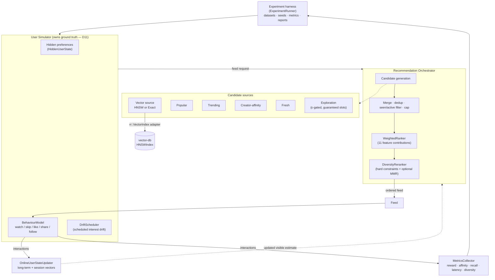
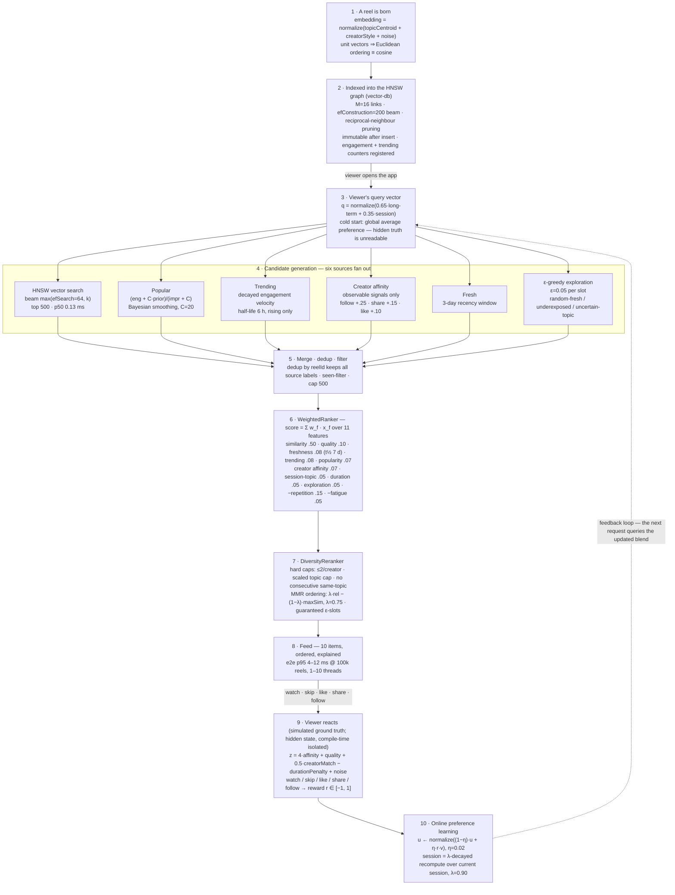

# ReelRank

[](https://github.com/Derran05W/reelrank-recommender/actions/workflows/ci.yml)

ReelRank is a **single-process, fully deterministic C++20 simulation and evaluation harness for
multi-stage short-video ("reels") recommendation**, built on top of a custom HNSW vector library.
It generates a synthetic world — topics, creators, reels, and users whose *hidden* preferences are
structurally invisible to the recommender — simulates observable behaviour (watch, skip, like,
share, follow, not-interested), and runs pluggable recommendation pipelines end to end: approximate
(HNSW) and exact vector retrieval, feature-based ranking, online preference learning, ε-greedy
exploration with cold start, and diversity-aware re-ranking. Every run is reproducible from a single
`uint64_t` master seed, and every published number carries full hardware/build provenance.

The **core engineering question** (design goal, not a marketing claim) is:

> How closely can approximate vector retrieval match exhaustive personalized search while
> dramatically reducing recommendation latency?

The answer ReelRank measures on production-like clustered data: **HNSW retrieval is quality-parity
with brute force at 48–62× lower retrieval latency** — the trade-off, and every secondary question
around it (cold start, drift, exploration/exploitation, ranking uplift, diversity cost, concurrency)
is quantified against committed baselines in [`docs/RESULTS.md`](docs/RESULTS.md).

**What this is and is not.** ReelRank is a portfolio project. It demonstrates a complete,
tested understanding of embedding-based retrieval, approximate nearest-neighbour search, multi-stage
recommendation, online learning, exploration vs. exploitation, feed diversity, synthetic
evaluation, performance engineering, and test-driven system development. It is **not** a TikTok
clone and makes no claim to reproduce any production system: there is no real media, no neural
ranker, no service mesh, and the "ground truth" is a synthetic behaviour model, not human users
(see [`docs/LIMITATIONS.md`](docs/LIMITATIONS.md)). The project is deliberately two repositories,
telling a two-part story:

- **[`vector-db`](https://github.com/Derran05W/vector-db)** — the low-level ANN *infrastructure*
  (a from-scratch C++ HNSW index). Consumed read-only; never modified by ReelRank.
- **`reel-rank`** (this repo) — the *application*: a recommendation system and evaluation harness
  that puts that infrastructure to work on a realistic workflow.

---

## Architecture

The as-built pipeline (Phases 0–11). A feed request flows top to bottom; interactions flow back into
online learning and the metrics collector. The HNSW index from `vector-db` sits under the vector
candidate source, reachable only through the `rr::VectorIndex` adapter — no other ReelRank code sees
a vector-db symbol.



Six candidate sources feed the merge stage; which ones are active depends on the algorithm (see
[Apps reference](#apps-reference)). Ground-truth hidden preferences live in a separate
`HiddenUserState` struct owned by the simulator, so "the recommender never reads hidden preference"
is a compile-time guarantee, not a convention (design decision **D11**). The `hnsw_ranker_diversity`
"complete initial system" wires all six sources; simpler algorithms use a subset.

## The pipeline: from a reel to a viewer, and back

The same system as a stage-by-stage flow — every step a reel passes through, with the algorithm
doing the work at each one. All parameters are the shipped defaults; all timings measured
(Apple M5, Release build, 100k reels). Stages 1–2 are the content path; 3–8 run per feed request;
9–10 close the loop that makes the next request smarter.



---

## Prerequisites

- CMake >= 3.20
- A C++20 compiler (AppleClang / Clang / GCC)
- A sibling `vector-db` checkout (default location `../vector-db`; override with
  `-DREELRANK_VDB_DIR=/path/to/vector-db`)
- Network access on first configure (FetchContent pulls nlohmann/json v3.11.3 and GoogleTest
  v1.15.2), and on the first `uv run` of the plotting scripts (uv resolves Python 3.12 and the
  pinned packages)
- Python 3.12 + [uv](https://docs.astral.sh/uv/) *only* for the plotting/analysis scripts (see
  [`scripts/`](scripts/)); the simulator and benchmarks are pure C++ with no Python dependency.

## Build and test

Debug:

```sh
cmake -S . -B build-debug -DCMAKE_BUILD_TYPE=Debug
cmake --build build-debug
ctest --test-dir build-debug --output-on-failure
```

Release (what all published experiments use):

```sh
cmake -S . -B build-release -DCMAKE_BUILD_TYPE=Release
cmake --build build-release
ctest --test-dir build-release --output-on-failure
```

The test suite is a single `reel_rank_tests` binary (unit / integration / property / differential
suites, distinguished by GoogleTest filters and CTest labels): **961 tests, all green** on
macOS/AppleClang and Ubuntu/GCC (Debug and Release, verified in CI) — 533 at the V1 milestone,
grown through Realism V2 (Phases 13–23). Performance benchmarks are separate executables under
`apps/` and are never run by `ctest` (design decision D7). Note: the ctest registration reglobs
at BUILD time — run `cmake --build build` before `ctest` for an accurate count.

Point at a non-default vector-db checkout:

```sh
cmake -S . -B build-release -DCMAKE_BUILD_TYPE=Release -DREELRANK_VDB_DIR=/abs/path/to/vector-db
```

## vector-db integration (shadow build)

vector-db's `CMakeLists.txt` derives all of its source paths from `${CMAKE_SOURCE_DIR}`, so it
cannot be consumed via `add_subdirectory` without editing it — and vector-db is out of scope for
ReelRank changes. Instead, `cmake/vendor_vector_db.cmake` builds the `vdb_core` static library
ourselves directly from the checkout, mirroring upstream's target exactly (source list, PUBLIC
include dirs, `nlohmann_json` PUBLIC link, and x86-64 SIMD flags). It is exposed as
`vector_db::vdb_core`.

Because we never include vector-db's own `CMakeLists.txt`, the upstream `VDB_BUILD_TESTS`,
`VDB_BUILD_BENCHMARKS`, and `VDB_BUILD_SERVER` options are moot — no httplib download, no stray
`basic_usage` target, and no second copy of GoogleTest in the build tree. Vendored headers are
included as `SYSTEM`, keeping them out of ReelRank's `-Werror` warning set.

Per design decision **D2**, vector-db symbols (global namespace: `Vector`, `HNSWIndex`, ...) are
only ever touched by the adapters under `src/vindex/` and the link-sanity integration test. The rest
of ReelRank sees only the `rr::VectorIndex` abstraction. All embeddings are L2-normalized and every
index uses Euclidean distance, so ordering is exactly cosine ordering and exact-vs-HNSW comparisons
are metric-identical (**D3**).

---

## Apps reference

Four executables (plus one concurrency probe) built under `build-release/apps/`. All are
deterministic for a given `(config, seed)`.

| Executable | Purpose | Key flags |
|---|---|---|
| `simulate` | Run one experiment end to end (dataset → simulation loop → metrics → `results/<id>/`). The workhorse. | `--config <path>` (default `configs/small.json`), `--algorithm <name>`, `--seed <N>`, `--out <dir>` (default `results`), `--smoke` (tiny CI dataset) |
| `inspect_user` | Dataset inspection (topic/quality histograms) and, with `--explain-user`, one user's ranked feed with the **per-feature ranking contribution breakdown** (the explainability view). | `--config <path>`, `--seed <N>`, `--out <path>` (default stdout), `--explain-user <ID>`, `--warmup <ROUNDS>` (default 30) |
| `benchmark_retrieval` | HNSW-vs-exact retrieval sweep (Recall@K, distance error, p50/p95/p99, graph stats, distance-comp counts) over corpus size × dimension × efConstruction × M × efSearch × k. | `--seed`, `--out`, `--queries`, `--dims 32,64,128,256`, `--efcs 50,100,200,400`, `--ms 8,16,32`, `--vector-counts 10000,100000,1000000`, `--clustered [--clustered-query-source reels\|users]`, `--count-distances`, `--smoke` |
| `benchmark_recommender` | Closed-loop, multi-threaded load driver for the full recommender over one shared frozen index (RPS, e2e + per-stage tail latency, CPU%, peak RSS). | `--reels`, `--users`, `--dim`, `--threads <list>`, `--requests-per-thread`, `--warmup`, `--seed`, `--out`, `--smoke` |
| `concurrency_check` | Standalone TSan probe: many concurrent `const` searches on a frozen `HNSWVectorIndex` verify data-race-freedom (design decision D13). | `--seed`, `--vectors`, `--dim`, `--threads`, `--searches`, `--k`, `--smoke` |

**Algorithm names** accepted by `simulate --algorithm` / the recommender factory
(`makeRecommender`):

| Name | Recommender | Notes |
|---|---|---|
| `random` | RandomRecommender | baseline |
| `popularity` | PopularityRecommender | baseline (Bayesian-smoothed engagement) |
| `exact_vector` | ExactVectorRecommender | brute-force ground-truth retrieval |
| `hnsw` | HNSWRecommender | similarity-only ANN retrieval |
| `hnsw_ranker` | HNSWRankerRecommender | 4 sources → WeightedRanker (11 features) |
| `hnsw_ranker_exploration` | HNSWExplorationRecommender | adds ε-greedy exploration + fresh + guaranteed slots |
| `hnsw_ranker_diversity` | FullRecommender | + DiversityReranker; **`exploration.enabled=true` ⇒ the complete initial system** (all six sources), `false` ⇒ diversity-isolation mode |

---

## Configuration reference

Config is JSON (nlohmann/json). Every block has explicit defaults matching the TDD's suggested
values; **unknown keys are an error** (catches typos), and every experiment writes its fully-resolved
config back out as `config.json`. Keys are `snake_case`; missing keys keep the default. Presets live
in [`configs/`](configs/): `small`, `medium`, `large`, `benchmark`, plus `phase8-coldstart` and
`phase10-drift`.

### `simulation`
| Key | Default | Meaning |
|---|---|---|
| `seed` | `42` | master random seed; all subsystem RNG streams derive from it (D8) |
| `users` | `10000` | number of synthetic users generated |
| `reels` | `100000` | number of synthetic reels generated |
| `creators` | `5000` | number of synthetic creators |
| `topics` | `32` | number of topic centroids |
| `dimensions` | `64` | embedding dimension (supports 32/64/128/256) |
| `interactions_per_user` | `200` | interactions simulated per user (drives the round count) |
| `new_users` | `0` | mid-simulation injected users (cold-start experiments); `0` disables |
| `new_users_at` | `0` | 0-based round index at which injected users appear |
| `new_reels` | `0` | mid-simulation injected reels; `0` disables |
| `new_reels_at` | `0` | 0-based round index at which injected reels appear |

### `recommendation`
| Key | Default | Meaning |
|---|---|---|
| `feed_size` | `10` | items returned per feed request |
| `vector_candidates` | `500` | top-N retrieved from the vector source (also the merged-pool cap / `candidateLimit`) |
| `popular_candidates` | `100` | candidates from the Popular source |
| `fresh_candidates` | `100` | candidates from the Fresh source |
| `exploration_candidates` | `50` | candidates from the Exploration source |
| `trending_candidates` | `100` | candidates from the Trending source |
| `creator_affinity_candidates` | `100` | candidates from the Creator-affinity source |

### `hnsw`
| Key | Default | Meaning |
|---|---|---|
| `m` | `16` | HNSW graph degree |
| `ef_construction` | `200` | build-time beam width |
| `ef_search` | `64` | query-time beam width (search uses `max(ef_search, k)`) |

### `ranking` (WeightedRanker feature weights — sum of contributions = score)
| Key | Default | Meaning |
|---|---|---|
| `similarity_weight` | `0.50` | cosine similarity of candidate to the user's estimated preference |
| `quality_weight` | `0.10` | reel intrinsic quality |
| `freshness_weight` | `0.08` | recency (half-life decay) |
| `popularity_weight` | `0.07` | pool-local smoothed popularity prior |
| `trending_weight` | `0.08` | positive-velocity trending signal |
| `creator_affinity_weight` | `0.07` | recommender-visible creator-affinity estimate |
| `exploration_weight` | `0.05` | bonus for exploration-labelled candidates |
| `repetition_penalty` | `0.15` | penalty (subtracted) for repeated topics/creators in the pool |
| `duration_match_weight` | `0.05` | match of reel duration to user tolerance |
| `impression_penalty_weight` | `0.05` | fatigue penalty (subtracted) on prior impression count |
| `session_topic_weight` | `0.05` | cosine to the user's session preference vector (Phase 7) |
| `freshness_half_life_seconds` | `604800.0` | freshness decay half-life (7 simulated days) |
| `trending_half_life_seconds` | `21600.0` | trending decay half-life (6 simulated hours) |

### `learning` (OnlineUserStateUpdater)
| Key | Default | Meaning |
|---|---|---|
| `enabled` | `true` | master switch; `false` freezes every user at the cold-start estimate |
| `long_term_rate` | `0.02` | η for the long-term update `u ← normalize((1−η)u + η·r·v)` |
| `session_rate` | `0.15` | **unused** (reserved for an incremental session variant; the λ-window recompute is used instead) |
| `recent_window` | `20` | interactions retained for the session-vector recompute |
| `session_lambda` | `0.90` | decay λ for the session vector over the recent window |
| `long_term_weight` | `0.65` | blend weight of the long-term vector in the estimate |
| `session_weight` | `0.35` | blend weight of the session vector in the estimate |

### `exploration` (ε-greedy)
| Key | Default | Meaning |
|---|---|---|
| `enabled` | `true` | enables the Exploration source (and, for `hnsw_ranker_diversity`, complete-system mode) |
| `epsilon` | `0.05` | per-slot ε gate probability |
| `fresh_window_seconds` | `259200.0` | recency window defining a "fresh" reel (3 simulated days) |
| `guaranteed_slots` | `2` | exploration items protected from being ranked out |

### `behaviour` (synthetic ground-truth model — `z = α·a + β·Q + γ·C − δ·D + ε`)
| Key | Default | Meaning |
|---|---|---|
| `alpha` | `4.0` | weight on base affinity `a = p_u·q_v` |
| `beta` | `1.0` | weight on intrinsic quality `Q_v` |
| `gamma` | `0.5` | weight on true creator affinity `C_{u,c}` |
| `delta` | `1.0` | weight on the duration penalty `D_v` |
| `noise_std` | `0.5` | stddev of the Gaussian noise term `ε` |
| `skip_bias` | `1.0` | bias `b` in `P(instantSkip) = sigmoid(−z + b)` |
| `not_interested_z` | `-2.0` | NotInterested is possible only when `z <` this |
| `not_interested_prob` | `0.05` | ... and then fires with this probability |

### `reward` (TDD §10.5 reward weights; reward clamped to `[−1, 1]`)
| Key | Default | Meaning |
|---|---|---|
| `watch_ratio_weight` | `0.45` | weight on watch ratio |
| `watch_seconds_weight` | `0.15` | weight on `log(1 + watchSeconds)` (normalized) |
| `like_weight` | `0.15` | weight on like |
| `share_weight` | `0.20` | weight on share |
| `follow_weight` | `0.15` | weight on follow |
| `instant_skip_penalty` | `0.35` | penalty (subtracted) on instant skip |
| `not_interested_penalty` | `0.75` | penalty (subtracted) on NotInterested |

### `diversity` (DiversityReranker)
| Key | Default | Meaning |
|---|---|---|
| `enabled` | `true` | applies the reranker (config-driven `request.enableDiversity`) |
| `max_per_creator` | `2` | hard cap on items per creator in a feed |
| `max_per_topic` | `3` | hard cap on items per topic (scaled by feed size) |
| `mmr_lambda` | `0.75` | MMR relevance-vs-diversity trade-off |
| `use_mmr` | `true` | order the selected set by MMR (`false` = constraints only) |

### `drift` (scheduled interest drift — empty = disabled, output byte-identical to a pre-drift run)
| Key | Default | Meaning |
|---|---|---|
| `events` | `[]` | list of drift events, each `{ at_interaction, cohort_lo, cohort_hi, topic_mix }` |

Each event: `at_interaction` (completed-interaction count that triggers the change), `cohort_lo` /
`cohort_hi` (the `[lo, hi)` slice of `hash01(userId)` this event applies to; disjoint ranges express
disjoint cohorts), and `topic_mix` — a list of `{ topic, weight }` (weights are relative; the mix is
normalized at application).

### `evaluation`
| Key | Default | Meaning |
|---|---|---|
| `oracle_sample_rate` | `0.05` | fraction of requests scored against the exhaustive oracle (regret) |
| `retrieval_sample_rate` | `0.02` | fraction of requests scored for live Recall@K / distance error |

### top-level
| Key | Default | Meaning |
|---|---|---|
| `algorithm` | `random` | recommender to run (see [algorithm names](#apps-reference)); `simulate --algorithm` overrides it |

---

## Results at a glance

All numbers below are copied from committed artifacts under `results/published/`; each row links to
its phase directory. **Hardware/provenance** (from Phase 11 `metadata.json`, the clean serialized
latency reference): **Apple M5, 10 cores, 24 GiB RAM, macOS (Darwin 25.5.0, arm64), AppleClang
21.0.0, C++20, Release (-O3)**, seed 42. Latencies from Phases 5–10 ran with some concurrency
contention (noted per phase); Phase 11 ran serially on an idle machine.

| Question | Measured result | Source |
|---|---|---|
| **HNSW vs exact** — quality cost & latency win (medium, 2M impressions) | mean true affinity **0.1062 vs 0.1079 (−1.5%)**, oracle regret +0.12% — parity — at retrieval **p50 0.132 vs 6.33 ms, p99 0.158 vs 9.78 ms (48–62× faster)**, 31× lower wall time | [`phase5/`](results/published/phase5/) |
| **Second-stage ranker uplift** (hnsw_ranker vs similarity-only) | reward/impression **0.0298 → 0.0671 (+125%, 2.25×)**; completions +15%, at −13% mean true affinity (documented engagement-vs-alignment trade-off) | [`phase6/`](results/published/phase6/) |
| **Online learning uplift** (learning vs frozen estimates) | reward/impression **0.0675 → 0.2141 (+217%, 3.17×)**, true affinity +162%, regret −21.5%, estimated↔hidden cosine **0.216 → 0.425** — improvement on every axis | [`phase7/`](results/published/phase7/) |
| **Exploration / cold start** (ε=0.05, the shipped default) | ε=0 is byte-identical to `hnsw_ranker`; ε=0.05 wins whole-population reward (+1.2%) and new-user regret (−2.3% at 50/100), new users **+26% reward/impression by impression 100**; injected-reel coverage +11.8% | [`phase8/`](results/published/phase8/) |
| **Diversity trade-off** (complete system, hard caps + MMR) | per-item topic diversity **+89%**, intra-list similarity −12%, repetition rate **exactly 0** — at −13.7% reward/impression and feeds shrinking 10.0 → ~6.3 items under hard caps (documented operating point) | [`phase9/`](results/published/phase9/) |
| **Drift adaptation** (session-aware vs long-term-only vs frozen) | session-aware ≥ long-term-only at **every** post-drift round; final estimated↔hidden alignment **0.662 vs 0.472**, drifted-cohort reward +46%; overall reward/impression 0.2564 vs 0.1945 (+32%) vs frozen 0.1369 (+87%) | [`phase10/`](results/published/phase10/) |
| **Recall at shipped defaults** (clustered data, M16/efC200/ef64) | **Recall@10 = 0.934 @10k / 0.919 @100k** (target >90% — PASS); 128d beats 64d (0.958) on clustered data | [`phase11/`](results/published/phase11/) |
| **Throughput scaling** (100k reels, full pipeline, T=1→10) | **349 → 1,821 RPS (5.2×)**; e2e p95 4.2 → 12.0 ms (target <25 ms — PASS); memory-bandwidth-bound ceiling | [`phase11/`](results/published/phase11/) |
| **1M-reel stretch** (concurrent reads on a frozen index) | build 640 s, peak RSS 2.0 GB, e2e p95 **43.9 ms (T=1) → 125.3 ms (T=10)**; TSan-verified data-race-free; pure HNSW search p95 ≤ 1.8 ms even at 1M | [`phase11/`](results/published/phase11/) |

Full narrative and figures: [`docs/RESULTS.md`](docs/RESULTS.md) and
[`results/published/figures/`](results/published/figures/) (see its
[`README.md`](results/published/figures/README.md)).

---

## Reproducing results

**Determinism (design decision D8).** A single `uint64_t` master seed seeds every subsystem via
independent named RNG streams (`rr::forkRng(seed, streamName)`), and all simulation randomness goes
through in-house portable samplers (`std::*_distribution` is banned outside `rr::Rng`). The same seed
therefore produces **byte-identical metric CSVs across compilers and platforms**. A determinism test
(same seed twice ⇒ identical CSVs) runs from Phase 2 onward.

**Which outputs are deterministic.** The metric CSVs are bit-reproducible:
`recommendation_metrics.csv`, `learning_curve.csv`, `regret_curve.csv`, `retrieval_metrics.csv`,
`diversity_metrics.csv` (and, for cold-start runs, `new_user_curve.csv` / `new_reel_exposure.csv`).
Only `latency_metrics.csv` and the `timing` block of `summary.json` are wall-clock measurements and
are expected to differ run to run. All published runs used the **Release** build.

**Re-running a published experiment.** Every published run commits its fully-resolved `config.json`.
Feed it straight back to `simulate` with the same seed and compare the deterministic CSVs. For
example, the Phase 10 `session_aware` arm (drift-adaptation study, medium config with four drift
cohorts):

```sh
# add -DREELRANK_VDB_DIR=/abs/path/to/vector-db if vector-db is not at ../vector-db
cmake -S . -B build-release -DCMAKE_BUILD_TYPE=Release && cmake --build build-release
./build-release/apps/simulate \
    --config results/published/phase10/session_aware/config.json \
    --seed 42 \
    --out results/repro
# then diff the deterministic CSVs against the published run (no output = byte-identical):
diff results/repro/*/recommendation_metrics.csv \
     results/published/phase10/session_aware/recommendation_metrics.csv
```

This is the full medium experiment (10k users × 100k reels × 200 interactions ≈ 2M impressions) and
takes several minutes; the committed `config.json` already carries `algorithm: hnsw_ranker`, the
`learning` weights (0.65 / 0.35), and the drift schedule, so no extra flags are needed.

**Batch runs and figures.** The Python tooling under [`scripts/`](scripts/) (uv;
`run_experiments.py`, `compare_results.py`, `plot_results.py`) only *reads* result CSVs/JSON — no
simulation logic lives in Python (D15). Figure regeneration is documented in
[`results/published/figures/README.md`](results/published/figures/README.md).

---

## Demo

[`scripts/demo.sh`](scripts/demo.sh) is a guided ~10-second tour: it runs the complete
`hnsw_ranker_diversity` pipeline on `configs/small.json` (1,000 users × 10,000 reels), prints a
narrated headline summary from the run's `summary.json`, then uses `inspect_user --explain-user` to
show one user's feed with **per-feature ranking contributions** — the explainability money shot.

```sh
bash scripts/demo.sh          # BUILD_DIR=... to override the build location
```

Sample output (headline block):

```
reward / impression      0.108   engagement quality (TDD reward)
mean true affinity       0.152   hidden-preference alignment
final est<->hidden cos   0.299   online-learning convergence
retrieval p95            0.40 ms HNSW candidate latency
recall@10                0.877   HNSW vs exact ground truth
feed diversity           3.49 topics / 6.61 creators, repetition 0.0  per feed
```

**Observed variance across 3 consecutive runs (2026-07-15):** zero on every simulated metric —
reward, affinity, alignment, recall, diversity, and every feed item, score, and per-feature
contribution in the explanation view were identical to the digit. The only lines that differed
were the temp-directory name and one wall-clock measurement (retrieval p95: 0.40 / 0.40 /
0.41 ms). Timing is measurement; everything else is reproducible bit-for-bit — the determinism
design doing exactly what it promises.

---

## Realism V2 (Phases 13–23)

V1 (above) demonstrates the retrieval/ranking/learning/diversity machinery on a world where
engagement *is* the ground truth. **Realism V2** breaks that equivalence: it adds a hidden
satisfaction model distinct from observable engagement, session dynamics with a probabilistic exit,
an event-driven simulation core with independent per-user timelines, exposure-driven preference
evolution and retention/churn, a seven-scenario ecosystem failure-mode suite, and — finally — a
ranker *learned* from a leak-proof observable training log rather than hand-tuned. Every V2
mechanism ships behind a config gate that **defaults off and reproduces V1 byte-for-byte** (decision
D17, checked every phase against a committed golden baseline); V1's 533-test baseline and every V1
number above is unaffected. Full story: [`docs/RESULTS-V2.md`](docs/RESULTS-V2.md).

**What's new, by mechanism:**

- **Satisfaction ≢ engagement** (Phases 13–15): reels gain independent modality/content factors
  (visual, music, emotional, usefulness, humour, controversy, clickbait strength, ...) and users gain
  a hidden `LatentReaction` (satisfaction, regret, informational/emotional value) that is *sampled
  into* observable behaviour rather than equal to it — ragebait can win engagement while losing
  satisfaction; useful content can win satisfaction on modest engagement.
- **Session health** (Phase 16–17): sessions gain hidden fatigue and a probabilistic, five-way
  classified exit (failure / satisfied / fatigue / external / regret) instead of a fixed length, plus
  a personalized diversity re-ranker driven by an observables-only tolerance estimate.
- **Event-driven core** (Phase 18–19): an optional deterministic event-driven runner replaces
  round-robin batches with independent per-user open/consume/exit/return timelines and a
  configurable feed-prefetch depth (the freshness-vs-cost axis).
- **Long-term effects** (Phase 20–21): recommendations can measurably reshape hidden preferences and
  future retention/churn; a seven-scenario ecosystem suite (filter bubbles, ragebait amplification,
  popularity feedback, niche starvation, creator overconcentration, exploration recovery,
  satisfaction-vs-retention) stress-tests classic recommender failure modes with pre-registered
  hypotheses.
- **Learned ranking** (Phase 22–23): a leak-proof eligibility→impression training log + in-house
  deterministic learners, closing the loop with a `LearnedRanker` retrained in-simulation that serves
  a multi-objective value function over the learned models.

### Config-gate map

All V2 config lives in the `realism`, `serving`, `evolution`, `retention`, and `learning_v2` JSON
blocks (see [`include/rr/infrastructure/config.hpp`](include/rr/infrastructure/config.hpp) for every
field). Every boolean below defaults to **`false`** / `"round_robin"`; gates that require an earlier
gate throw at config load if it's missing (fail-fast).

| Gate | Default | Requires | Turns on |
|---|---|---|---|
| `realism.content_v2` | `false` | — | Multi-factor `Reel` / `HiddenUserState`: modality embeddings, content scalars, the eight-archetype catalog (Phase 13) |
| `realism.latent_reactions` | `false` | `content_v2` | Hidden `LatentReaction` per impression + `BehaviourModelV2` — the engagement≢satisfaction mechanics (Phase 14) |
| `realism.session_dynamics` | `false` | `latent_reactions` | Hidden per-session fatigue + the probabilistic five-way classified exit + session utility U_s (Phase 16) |
| `realism.personalized_diversity` | `false` | `session_dynamics` | Observables-only `ToleranceEstimator` + per-user diversity caps / MMR-λ (Phase 17) |
| `simulation.scheduler` | `"round_robin"` | `session_dynamics` (to set `"event_queue"`) | `"event_queue"` switches to the deterministic event-driven runner (independent per-user timelines, Phase 18); `"round_robin"` is the permanent D17 golden path |
| `simulation.horizon_seconds` | `0.0` | `scheduler="event_queue"` | Simulated-seconds horizon (required `> 0` in event mode; ignored under round-robin) |
| `serving.prefetch_depth` / `refill_threshold` / `invalidate_on_intent_change` | `0` / `0` / `false` | `event_queue` | Feed-prefetch depth, threshold refill, and intent-swing invalidation — the freshness-vs-cost axis (Phase 19) |
| `realism.preference_evolution` | `false` | `session_dynamics` | Exposure-driven hidden-preference reinforcement/saturation, driven by hidden satisfaction, never reward (Phase 20) |
| `retention.enabled` | `false` | `session_dynamics` + `event_queue` | Hazard-based return-delay/churn model + trust/habit (Phase 20) |
| `evaluation.ecosystem_metrics` | `false` | `event_queue` | Per-simulated-day creator HHI / archetype exposure shares / niche match rate (Phase 21) |
| `learning_v2.training_log` | `false` | `event_queue` | Leak-proof eligibility→impression logging pipeline + emitted-file purity audit (Phase 22) |
| `learning_v2.survey.enabled` | `false` | `event_queue` (validated directly; used alongside `training_log` in practice) | The sanctioned noisy explicit-satisfaction survey — the only hidden-derived training signal (Phase 22) |
| `learning_v2.learned_ranker` | `false` | `training_log` | In-loop-retrained `LearnedRanker` serving the multi-objective value function over the Phase 22 models (Phase 23) |

**The D17 golden guarantee.** With every gate above off, V2 output is **byte-identical** to V1: the
same `configs/small.json` run and the Phase 10 drift arm are captured once as a committed reference
under [`tests/golden/v1-baseline/`](tests/golden/v1-baseline/), and every phase's exit criteria
require a gates-off re-run to reproduce that reference exactly (deterministic CSVs byte-for-byte,
`summary.json` non-timing fields bit-equal) — verified at every V2 phase through Phase 23. The
event-driven runner has its own equivalent: a committed event-log digest golden under
[`tests/golden/event-digest/`](tests/golden/event-digest/) pins the same-seed event sequence.

### Event-mode quickstart

A real, runnable command using the pinned tiny full-gate event-mode fixture (200 users, 2,000 reels,
6 simulated hours — the same config the D20 determinism golden reproduces, digest
`1533553118870293663` over 5,602 events) — completes in a few seconds:

```sh
# add -DREELRANK_VDB_DIR=/abs/path/to/vector-db if vector-db is not at ../vector-db
cmake -S . -B build-release -DCMAKE_BUILD_TYPE=Release && cmake --build build-release
./build-release/apps/simulate \
    --config tests/golden/event-digest/config.json \
    --seed 42 \
    --out results/v2-quickstart
```

The config already sets `algorithm: hnsw_ranker`, `simulation.scheduler: event_queue`, and the full
`content_v2` + `latent_reactions` + `session_dynamics` gate stack, so no extra flags are needed. For
a full medium-scale V2 experiment (10k users × 100k reels, event mode, 9 simulated days), see any
`results/published/phase20/*/config.json` and feed it back to `simulate` the same way V1's
[reproducing-results](#reproducing-results) section shows.

For the same-user, same-seed **engagement-vs-satisfaction two-worlds demo** (side-by-side reward,
completion, hidden satisfaction, regret, and session-health under two ranking-weight presets, under
2 minutes wall-clock), see [`scripts/demo_v2.sh`](scripts/demo_v2.sh).

### V2 documentation

| Doc | What's in it |
|---|---|
| [`docs/RESULTS-V2.md`](docs/RESULTS-V2.md) | The V2 §10 completion-audit evidence table (ten items, each with test names + published numbers) and the full experiment narrative, Phases 15–23 |
| [`results/published/phase21/ECOSYSTEM.md`](results/published/phase21/ECOSYSTEM.md) | The seven-scenario ecosystem failure-mode verdicts, pre-registered hypotheses included |
| [`results/published/figures-v2/`](results/published/figures-v2/) | The canonical V2 figure set, regenerated deterministically from published CSVs |
| [`docs/LIMITATIONS.md`](docs/LIMITATIONS.md) | V1 limitations plus the "V2 additions" section (same three-way honesty classification) |
| [`docs/design/`](docs/design/) | V1 *and* V2 design artifacts — both TDDs, both design-decision sets (D1–D16, D17–D25), all phase plans, and the phase-by-phase history |

---

## Documentation

- [`docs/RESULTS.md`](docs/RESULTS.md) — the core engineering question answered with numbers; every
  secondary question with a pointer to its experiment.
- [`docs/RESULTS-V2.md`](docs/RESULTS-V2.md) — the Realism V2 story: the §10 completion-audit
  evidence table plus the engagement-vs-satisfaction, session-health, event-driven/batch-frontier,
  retention, ecosystem, and learned-ranking results (Phases 13–23). See also
  [`results/published/phase21/ECOSYSTEM.md`](results/published/phase21/ECOSYSTEM.md) (the
  seven-scenario failure-mode verdicts) and [`results/published/figures-v2/`](results/published/figures-v2/).
- [`docs/LIMITATIONS.md`](docs/LIMITATIONS.md) — honest gaps, un-hit targets, deferred stretch goals
  (V1), plus a "V2 additions" section for the realism upgrade.
- [`docs/RESUME.md`](docs/RESUME.md) — the portfolio narrative, kept accurate to what was measured
  (V1 and V2).
- [`docs/design/`](docs/design/) — the pre-implementation design artifacts for **both** V1 and V2:
  both technical design documents, both design-decision sets (D1–D16, D17–D25), all session-sized
  phase plans, and the phase-by-phase history with every deviation and known issue.

## Layout

- `include/rr/`, `src/` — headers and implementations (namespace `rr`); `src/vindex/` holds the only
  translation units that see vector-db symbols
- `configs/` — `small`, `medium`, `large`, `benchmark`, `phase8-coldstart`, `phase10-drift` (V1,
  JSON); `realism-small`/`realism-medium*` and `scenarios/` (V2 realism + ecosystem-scenario configs)
- `apps/` — `simulate`, `inspect_user`, `benchmark_retrieval`, `benchmark_recommender`,
  `concurrency_check`, `train_models` (V2 offline learners)
- `tests/` — `unit`, `integration`, `property`, `differential` (one `reel_rank_tests` binary), and
  `golden/` (`v1-baseline/` — the D17 gates-off reference; `event-digest/` — the D20 event-log digest)
- `scripts/` — Python (uv) analysis + plotting tooling, `demo.sh` (V1) / `demo_v2.sh` (V2
  engagement-vs-satisfaction two-worlds demo), and the `phaseNN_comparison.py` / `phase21_scenarios.py`
  V2 report generators
- `docs/` — `RESULTS.md` / `RESULTS-V2.md`, `LIMITATIONS.md`, `RESUME.md`, `scenarios/` (V2
  ecosystem-scenario run notes), and `design/` (both TDDs, both design-decision sets, phase plans,
  phase history)
- `results/published/` — curated, committed benchmark reports, `figures/` (V1) and `figures-v2/`
  (V2), plus per-scenario ecosystem results under `phase21/` (rest of `results/` is gitignored)
- `cmake/` — `vendor_vector_db.cmake` (the vector-db shadow build)
